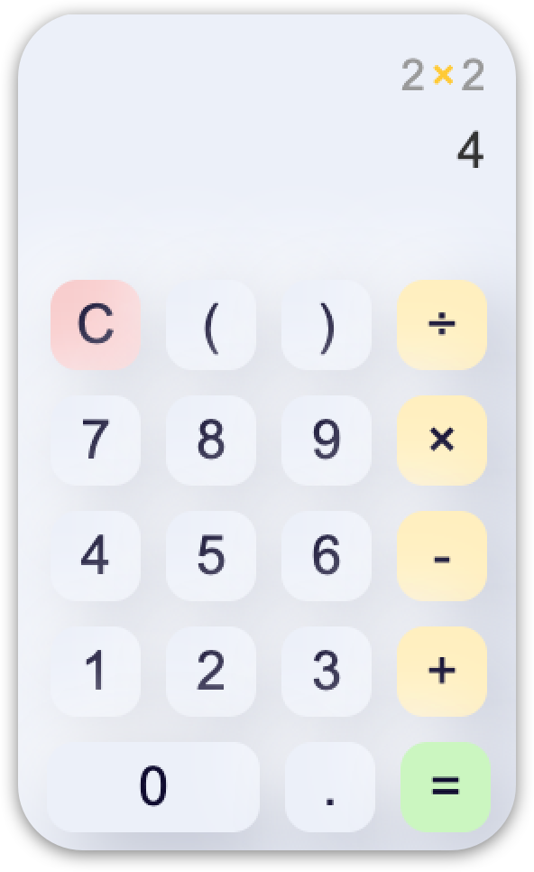
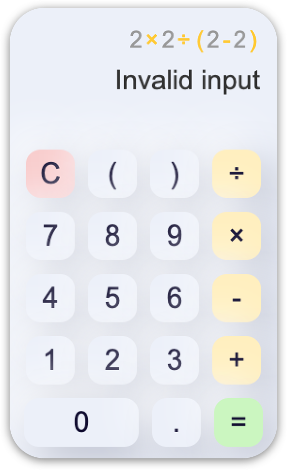

# neu-calculator &middot; [](https://github.com/moh3n9595/neu-calculator/blob/master/LICENSE) [](https://github.com/moh3n9595/neu-calculator/compare)


<p align="center">
    
  <br>
  <p align="center">
    Calculate with neumorphism UI and enjoy!
  </p>
  <br>
  <div align="center">
    
    
    
  </div>
</p>

## Getting started

We use [Electron React Boilerplate](https://github.com/electron-react-boilerplate/electron-react-boilerplate) in this project. So start with:
```
yarn dev
```

## Contributing

Thank you for your interest in contributing! Please feel free to put up a PR for any issue or feature request.

## Give me a Star

If you think this project is helpful just give me a ⭐️ Star is enough because i don't drink coffee 😃

## License

This project is licensed under the MIT License - see the [LICENSE.md](https://github.com/moh3n9595/neu-calculator/blob/master/LICENSE) file for details

## Author

Made with ❤️ by [Mohsen Madani](https://github.com/moh3n9595).